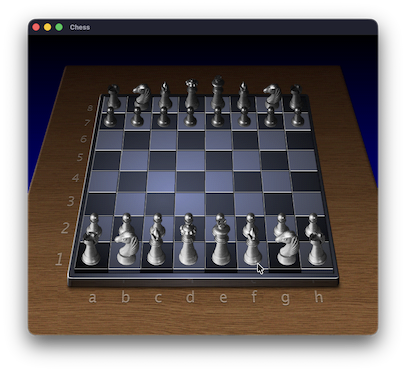

# Mac OS X 10.0 Chess

This repo contains the source code for [Mac OS X 10.0 Chess](https://github.com/apple-oss-distributions/Chess/tree/Chess-45),
updated to run on macOS 26.

## Motivation

My primary motivations to forward port this version of Chess to modern macOS are:

* nostalgia - I first saw the application run on NeXT Computers in 1992 and was amazed at how refined it looked.
* je ne sais quoi - Applications dating back to NeXT have this mysteriousness to them that make them interesting.
* evolution - What have we gained? What did we lose? What cruft remains?

## History

* 1988: First release of Chess - it was built into a binary file and likely pre-dated Interface Builder
* 1992: Chess repackaged using Bundles and supports both greyscale and color
* 1999: Chess ships as part of Mac OS X Server
* 2001: Chess ships as part of Mac OS X 10.0 and includes Apple Speech Recognition
* 2005: Chess updated with new engine and OpenGL frontend

It is instructive to see the systems that might run Chess from their given eras:

|Year|CPU|RAM|Storage|CPU Speed|Storage Speed|
|----|---|---|-------|---------|--------------|
|1988|68030 25MHz|8 MB|256 MB|1.0|1.0|
|1997|604e 166MHz|16 MB|2 GB|10x->20x|4x->10x|
|2001|750 233MHz|32 MB|4 GB|10x->20x|10x->40x|
|2026|A18 Pro|8 GB|256 GB|100x->???|1,000x->10,000x|

## The State of Chess.app in 2001

It is remarkable how long the Chess application had lasted up to its Mac OS X 10.0 release in 2001. Given the relentless
progress of computers as well as being owned by perpetually beleaguered companies through the 1990s, we can see
a lot of cruft that had built up to 2001:

* CVS version control information
* Old NeXT Makefiles
* [Unused images](Chess/English.lproj/clock.tiff) including greyscale images.
* [Unused source code](Chess/Clock.m)
* [K&R C](Chess/gnuchess.subproj/gnuchess.c)
* Lots of Postscript style drawing

Before releasing the Chess application for Mac OS X, Apple:

* Added support for its new compositing engine
* Added support for Mac features such as Speech Recognition

## What Changed Since 2001

There are a number of things that worked in 2001 that no longer work on modern macOS. These changes became apparent
when porting Chess forward to macOS 26.

* Old `.pbproject` and `.nib` files no longer load. This required recreating the nibs by hand which was quite time
consuming.
* Files are standardized more robustly now, particularly TIFF files with transparency. A lot of the original
application TIFFs would not load properly on modern macOS and had to be recreated and cleaned up.
* Apple Speech Recognizer is encapsulated in NSSpeechRecognizer, significantly simplifying this portion of the code.
* "Inline" animation is no longer allowed but instead all drawing has to happen through `drawRect`. This requires
explicitly maintaining state for animations (note these were pretty broken in Chess 10.1 anyway).

## Some Lessons Learned

It is too easy to look back on the "good old days" and forget how much progress we have made.

For the most part, the Chess application had weak typing in place due to its K&R GNU chess engine and original
Objective-C based Actions and Outlets. Having strong types in place made it a lot easier to understand the code and
hook the interface upto the code.

I was surprised how much time I spent putting together and wiring up the UI and there are still issues. It is time to
embrace SwiftUI.

I started doing the port by hand, but it quickly became clear that vibe coding is the reality now. We should embrace
this future and use it by default.

## Some Surprises

* A lot of the original Mac OS X 10.0 image compositing APIs have been deprecated.
* Many APIs, such as the Speech Recognition APIs exist but are basically NOPs.
* There may be legacy cruft in how NSImages are handled with respect to loading multipage TIFFs that may date back to
the original NeXT Computer. It seems macOS will skip pages that are 2 bit greyscale and use the first larger bit depth
image.

## Current State

The code builds and runs on a modern Mac which was the goal. It is not in an ideal, happy place and a lot of cleanup
work remains undone. This is left as an exercise for the reader to complete.

## Thank You

* Apple for releasing the original source code
* Everyone involved in the development of Chess
* Claude for doing the heavy lifting

## References

* [NeXT Computer](https://en.wikipedia.org/wiki/NeXT_Computer)
* [Power Macintosh 7300](https://en.wikipedia.org/wiki/Power_Macintosh_7300)
* [Power Macintosh G3](https://en.wikipedia.org/wiki/Power_Macintosh_G3)
* [MacBook Neo](https://en.wikipedia.org/wiki/MacBook_Neo)
* [Mac OS X 10.0 Chess source](https://github.com/apple-oss-distributions/Chess/tree/Chess-45)
* [Panther Chess source](https://github.com/apple-oss-distributions/Chess/tree/Chess-103.0.3)
* [Objective C](https://en.wikipedia.org/wiki/Objective-C)
* [NeXTStep 3.0 Running on Infinite Mac](https://infinitemac.org/1992/NeXTStep%203.0)
* [Mac OS X 10.1 Running on Infinite Mac](https://infinitemac.org/2001/Mac%20OS%20X%2010.1)
* [Mac OS X Server 1.0](https://en.wikipedia.org/wiki/Mac_OS_X_Server_1.0)
* [Mac OS X 10.0](https://en.wikipedia.org/wiki/Mac_OS_X_10.0)
* [Mac OS X Panther](https://en.wikipedia.org/wiki/Mac_OS_X_Panther)
* [Mac OS X Tiger](https://en.wikipedia.org/wiki/Mac_OS_X_Tiger)

## Suggestions

* [Avie Tevanian: CMU math whiz goes from Mach to NeXT to Apple Software Chief | Oral History Part 1](https://www.youtube.com/watch?v=vwCdKU9uYnE)
* [Oral History of Bertrand Serlet](https://www.youtube.com/watch?v=qpIuIImN0YI)
* [Microsoft hasn't had a coherent GUI strategy since Petzold](https://www.reddit.com/r/hackernews/comments/1sdie9t/microsoft_hasnt_had_a_coherent_gui_strategy_since/)
